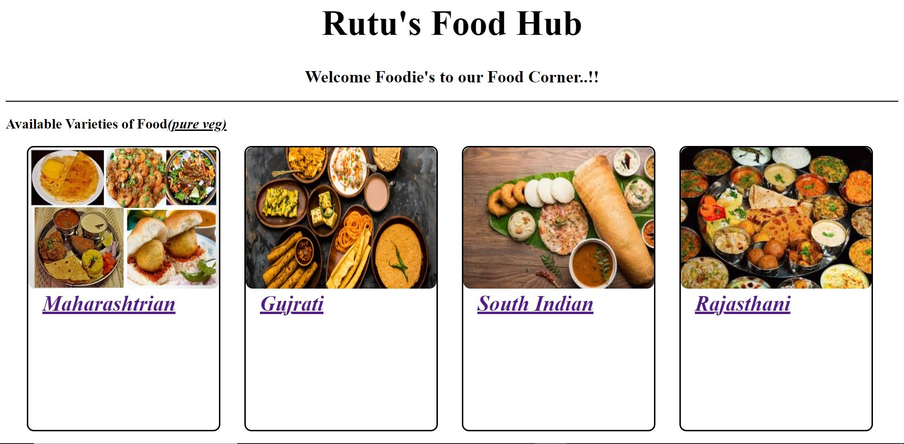

 ## Welcome To Rutu's Food hub!
 
 Welcome to Rutu's delicious food hub.
 Thus, a spot on the World Wide Web i.e. restaurant websites are the most essential thing. Restaurant websites can help by sharing a lot more information with customers than they would get to know from other sources. They help in finding maps, offers and discounts as well as special days.

 ## Guest Experience:
  Use a theme that is easy to navigate, includes bold call-to-action buttons for ordering and booking, and has plenty of space for large imagery to feature your dishes. Try and find a theme that includes a dedicated section for customer reviews.
 
 

 ## Contributer

 

Made with [contrib.rocks](https://contrib.rocks).